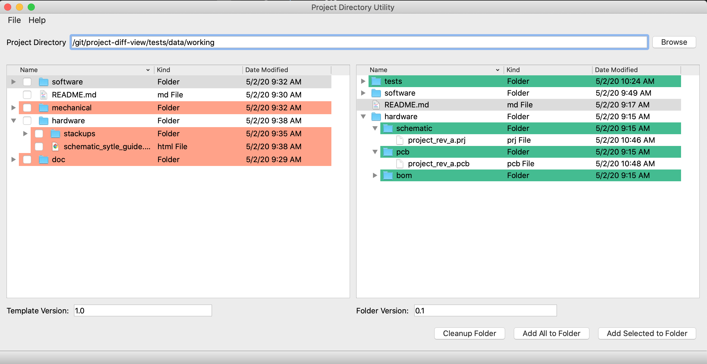

# projectdiffview

Utility to make managing project directories easier.



## Developer Install

1. Clone the repo
2. `cd projectdiffview`
3. Create a virtual environment with `virtualenv .venv`
4. [Activate that environment](https://virtualenv.pypa.io/en/latest/)
5. `pip install -r requirements-dev.txt`
6. `pre-commit install`
7. `pip install -e .`
8. `tox`

## Regular Install

1. Clone the repo
2. `cd projectdiffview`
3. `pip install -e .`

## Changing the template path

Open `defaults.py` in a text editor and update the `TEMPLATE_DIRECTORY` to the correct path.  The application should be able to support any path that pathlib supports.  You may have to re-install with `pip install -e .` from the root directory.

```python
TEMPLATE_DIRECTORY = Path(__file__).parents[1].joinpath("template")
```

## Updating the builtin template

Git does not allow you to store empty directories, so there is an empty `.keep` file in every "empty" directory.
